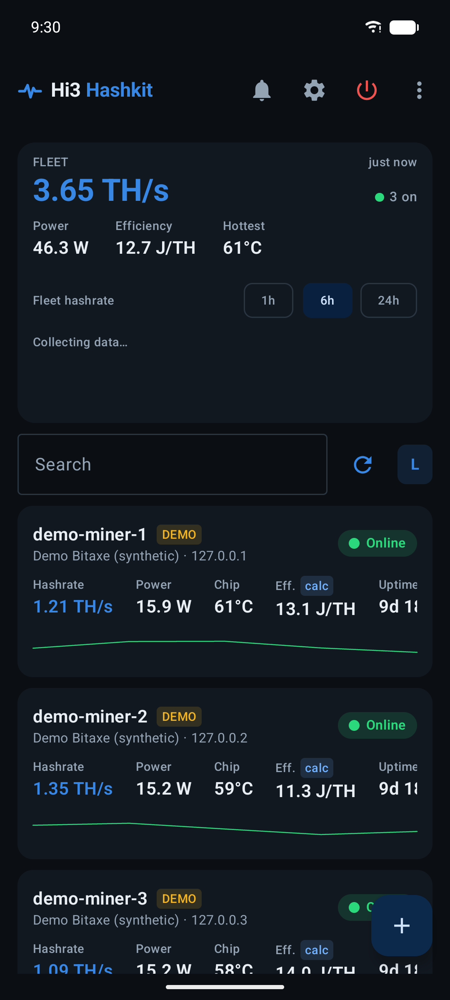
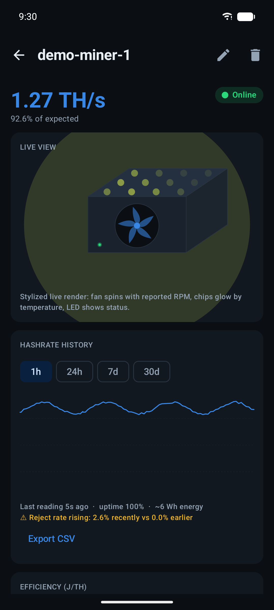
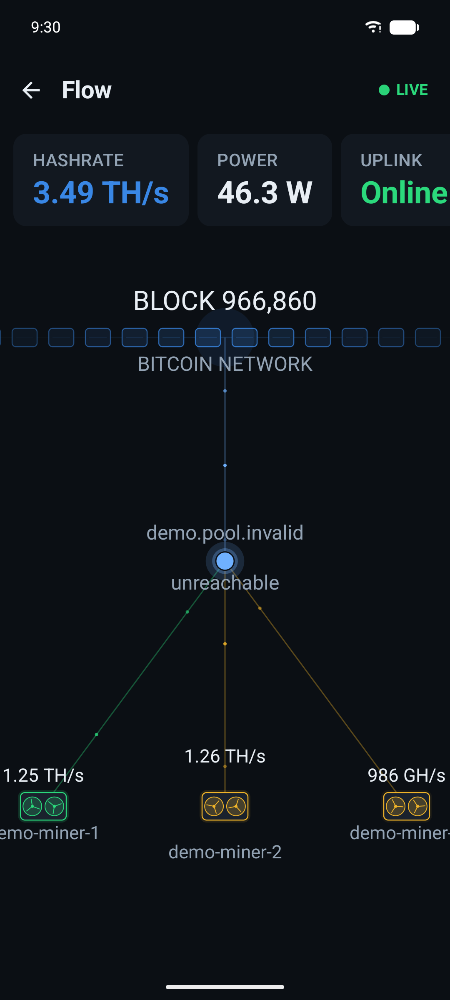
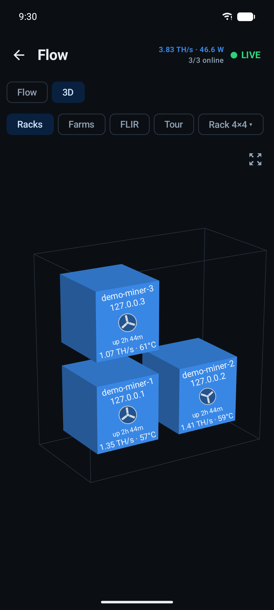
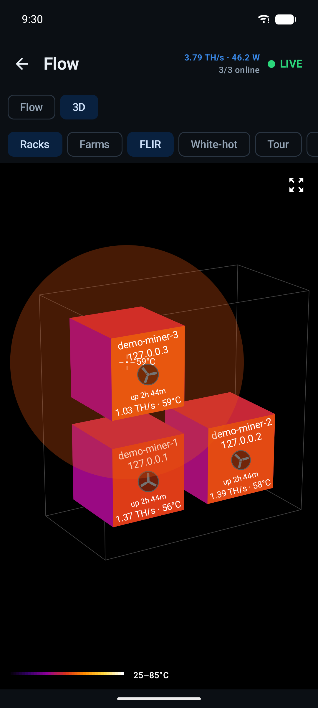
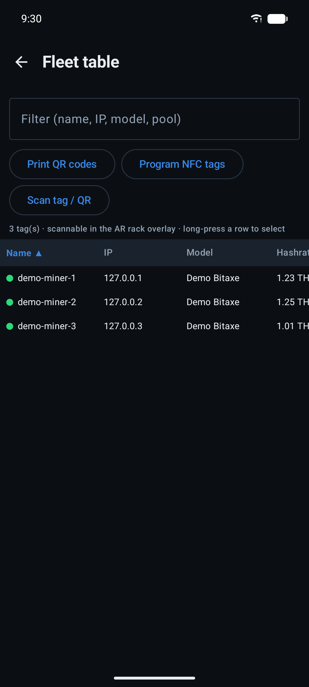
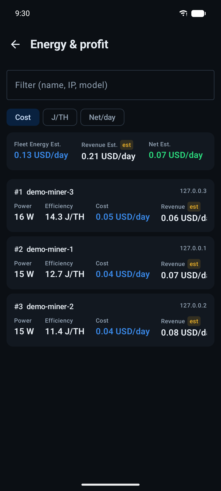
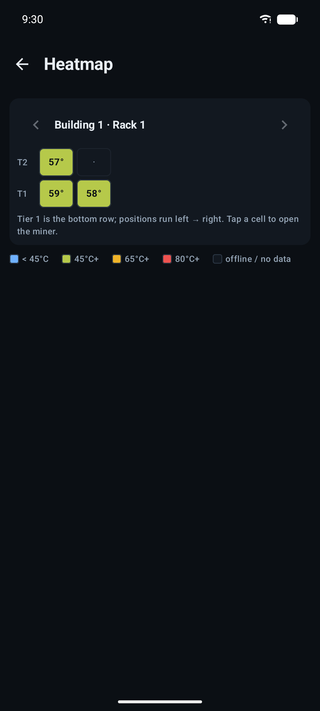
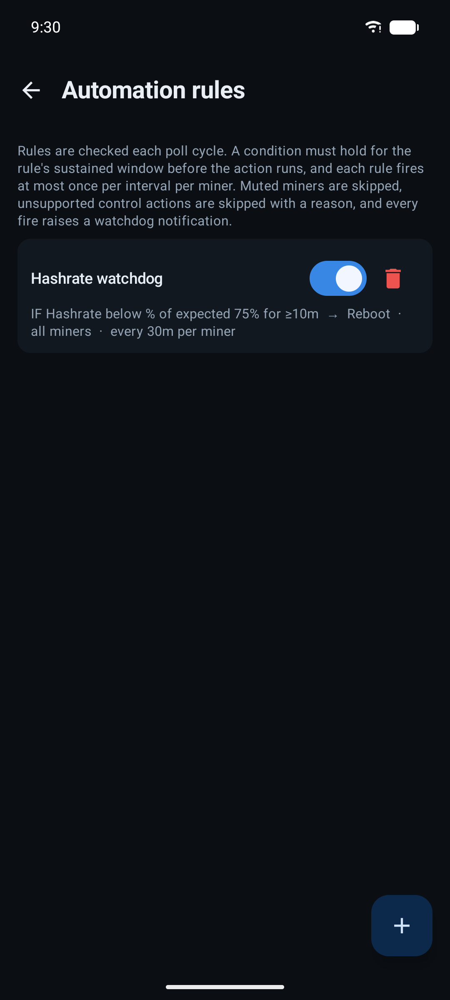

# Hi3 Hashkit

**Current version: 0.82.0**

Hi3 Hashkit is a privacy-first, local-first Android app for monitoring and safely
controlling your Bitcoin miners. It talks only to the miners on your own network — over
LAN or your Tailscale VPN — with no account and no cloud. Every reading is labeled by how
it was obtained (measured, reported, calculated, estimated, or unavailable), so an
estimate is never dressed up as a fact.

See `docs/` for architecture, device support, build, and security details, and
`CHANGELOG.md` for release-by-release notes.

## Screenshots

All captures below use the app's built-in demo mode (synthetic miners).

| Dashboard | Miner detail | Flow view |
|---|---|---|
|  |  |  |

| 3D fleet view | FLIR thermal | Fleet table |
|---|---|---|
|  |  |  |

| Energy & profit | Site heatmap | Watchdog rules |
|---|---|---|
|  |  |  |

🎬 [Watch the 2-minute app overview](docs/media/hashkit-overview.mp4) · [40-second quick tour](docs/media/hashkit-tour.mp4)

## Key features

**For the home miner**
- **Set up a new Bitaxe from the phone** — join its `Bitaxe_XXXX` hotspot from inside the
  app and hand it your Wi-Fi, a name and a pool; no captive portal.
- **One-tap firmware update** — download the official AxeOS image and flash a Bitaxe over
  the LAN, with progress, reboot wait and version check.
- **Personal bests & share card** — a record book of best shares with "% of a block", a
  dashboard trophy card, and a branded stats-card PNG for the share sheet.
- **Quiet / Normal / Boost** modes within the firmware's approved values, plus a
  "Quiet at night" switch.
- **What this costs** — monthly power bill, expected earnings, payback on what you paid,
  and the honest solo-lottery framing.
- **Single-miner widget, Quick Settings hashrate tile**, Bitaxe screen settings, and a
  dust nudge when chip temps creep up at unchanged power.

**Monitoring & insight**
- **Auto-discovery** — scans your local subnet at launch and on demand (plus **mDNS/DNS-SD**
  discovery), so miners appear without manual entry. Add by IP or CIDR too.
- **Live fleet dashboard** — hashrate, temps, power, efficiency and health per miner, with
  fleet totals, trend charts, per-miner sparklines, search, and Large/Medium/Compact/Grid
  layouts.
- **Sortable fleet table** — a dense, spreadsheet-style view (name·IP·location·model·
  hashrate·temp·fan·pool·uptime·J/TH) with tap-to-sort columns, a filter box, and
  long-press multi-select for bulk actions.
- **Per-chip / per-chain health** — for Antminer-class miners, a per-board table with
  hashrate, working/dead chip counts, hardware errors and hottest-chip temp.
- **Efficiency (J/TH) trend chart** and **statistical anomaly detection** (gradual hashrate
  drift / rising reject rate) that a fixed threshold misses.
- **Profitability & energy** — estimated revenue, power cost, net, BTC/day, kWh/day and
  heat, plus a **Bitcoin network card** (block height, subsidy, next difficulty adjustment
  and halving countdown).
- **Animated Flow view** — the Bitcoin network → pool → miners pipeline with live share
  particles, as a single row or a 2×2–8×8 tile grid.
- **3D fleet view** — orbit the whole fleet in real or virtual racks (2×2–8×8), fans
  spinning on both ends of every machine with live hashrate and chip temp, a drone-style
  **Tour** mode, and a one-tap **FLIR thermal mode** (ironbow / white-hot over live chip
  temps with a crosshair on your hottest miner).
- **Multiple farms/sites**, a **rack/site layout view**, a **wall / TV kiosk mode**
  (Small/Medium/Large), and a home-screen widget.

**Control & automation (where verified)**
- **Safe controls** — reboot, pool change, fan and firmware-bounded tuning, each with
  confirmations, bounds and rollback; bulk actions; a fleet-wide **Panic** (pause/reboot all).
- **Automation rules engine** — "if condition then action" (temp/hashrate/reject/offline →
  pause/resume/reboot/plug on/off/notify), scoped to all miners or a group.
- **Schedules** — time-of-use pause/resume, pool/fan changes, and smart-plug on/off.
- **Auto-recover** — power-cycle a stuck miner's smart plug or reboot it, once, with audit.
- **Bitaxe auto-tuner** — sweeps firmware-approved frequencies under a chip-temp ceiling and
  recommends the best point for efficiency or hashrate, with rollback.
- **Pool & wallet address book** — save pools/wallets and apply one across the fleet in a tap.

**Alerts & integrations**
- **Alerts & health** — thresholds for low hashrate, hot chips/VR, reject rate, fan stall,
  offline, pool disconnect, plug cutoff, firmware-available and solo **block-found**, with
  per-miner overrides, **quiet hours** and a **daily digest**.
- **Push notifications** to your own webhook (ntfy / Gotify / Telegram / generic), plus
  notification quick-actions (Reboot / Acknowledge).
- **Home Assistant / MQTT** publish of fleet + per-miner telemetry to a local broker.
- **Local web dashboard + Prometheus `/metrics`** (Advanced) — a read-only HTML fleet page
  and a Grafana scrape endpoint on your LAN.
- **Wear OS tile** showing fleet hashrate/status, themed to your app accent.

**Platform & privacy**
- **7 languages** — English, Spanish, Chinese (Simplified), Russian, German, French and
  Brazilian Portuguese; pick per-app in Settings → Display (or System Settings → App
  languages on Android 13+), applied instantly.
- **Hashkit WiFi kit** (Settings → Hashkit WiFi) — support for the pocket field AP: save
  the kit passphrase, add the network to your phone, print a Wi-Fi join QR, and verify
  you're on the miner subnet (with a static-IP fix hint when the site LAN has no DHCP).
- **Local-first & private** — nothing leaves the device except requests to your configured
  miners and strictly opt-in, off-by-default integrations (see Privacy below).
- **Encrypted at rest** — per-miner admin passwords/tokens are stored with the Android
  Keystore (AES-256-GCM); Android auto-backup is disabled.
- **Maintenance log** — timestamped per-miner notes with optional photos.
- **UI Theme** (six accent colors), System/Dark/Light modes, biometric/PIN app lock, and an
  Advanced-features gate for future licensing.
- **Android TV** support (leanback), Wear OS companion, and honest measured/estimated labeling.

## Supported miners

Every miner API is verified against real hardware or vendor documentation before it ships;
unverified controls are shown as unsupported, never guessed. Full matrix in
`docs/DEVICE_MATRIX.md`.

| Firmware / device | Monitoring | Controls |
|---|---|---|
| ESP-Miner / AxeOS (Bitaxe Ultra/Supra/Gamma/…) | Full | Reboot, pool, fan, bounded tuning + auto-tuner |
| NerdQAxe | Full | Reboot |
| Lucky-Miner-style ESP-Miner forks | Full | Monitoring-only (unverified) |
| Canaan Avalon Nano 3 | Full | Pause/Resume, Reboot |
| Canaan Nano 3S / Avalon Q / Mini 3 | Monitoring (compat) | Pause/Resume, Reboot (compat) |
| Braiins OS (BMM 100) | Full (no power sensor) | Pause/Resume |
| Stock Bitmain / BMMiner (Antminer S21 Pro, S-series) | Hashrate, expected, per-chain temps, fans, freq, ASIC count | Reboot (web CGI) |
| VNish (Antminer S21 Pro forks) | Full incl. **wall power** & efficiency | Reboot, Pause/Resume |
| LuxOS | Basic (hashrate, shares, uptime, pool) | Pause/Resume |
| WhatsMiner (MicroBT) | Hashrate, shares, temps, fans, power (compat) | — (encrypted token API unverified) |
| FutureBit Apollo II / Apollo OS (GraphQL, dashboard password) | Hashrate, power, temps, fans, shares, pool | — (unverified) |
| Generic cgminer (long tail) | Basic (hashrate, shares, uptime, pool) | — (unverified) |
| Demo | Synthetic (demo mode only) | — |

A metering smart plug (Tasmota/Shelly/Kasa — incl. KP125M/Tapo via your TP-Link account)
supplies **measured wall power** that drives efficiency and cost for any miner, plus its
today/lifetime energy counters; miners with no power sensor (e.g. stock Bitmain) get their
watts from it entirely.

## Requirements

- Android 8.0 (API 26) or newer; optional Wear OS companion and Android TV support.
- The miners reachable on your LAN, or over Tailscale (advertise the subnet route for
  remote sites).
- Sideload the APK (not on the Play Store).

## Quick start

```bash
export JAVA_HOME=$(/usr/libexec/java_home -v 17 2>/dev/null || echo /opt/homebrew/opt/openjdk@17/libexec/openjdk.jdk/Contents/Home)
./gradlew test assembleDebug
# APK: app/build/outputs/apk/debug/app-debug.apk
```

Install: `adb install app/build/outputs/apk/debug/app-debug.apk`, or copy the APK to
the phone and open it (enable "install unknown apps" for your file manager).

## Privacy behavior

Nothing leaves your device except requests to the miner IPs you configure, plus a set of
**strictly opt-in, off-by-default** integrations (see `docs/SECURITY.md` for exactly what
each transmits):

- **Read-only:** network-difficulty & BTC-price fetch (mempool.space), Hi3 Pool stats keyed
  by your payout address, the Hi3 MMP fleet view (API key stored in the Android Keystore),
  and an AxeOS firmware-update check.
- **Outbound push you configure:** an alert webhook (ntfy/Gotify/Telegram/generic).
- **Local network only:** MQTT publish to a broker you choose, the local web dashboard /
  Prometheus endpoint (Advanced), a small fleet summary to a paired Wear OS watch, and
  smart-plug commands + power reads.

The phone never uploads miner data to us — MMP agent functionality remains a disabled
placeholder. Polling runs while the app is open; optional background monitoring (WorkManager,
~15-min Android minimum) is off by default and enabled in Settings.
